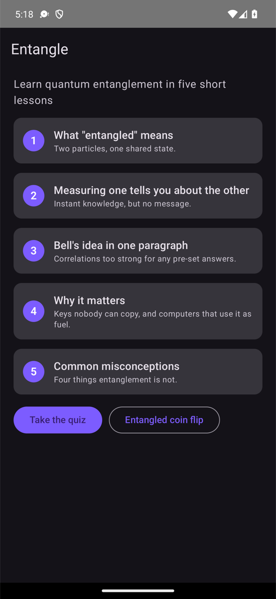
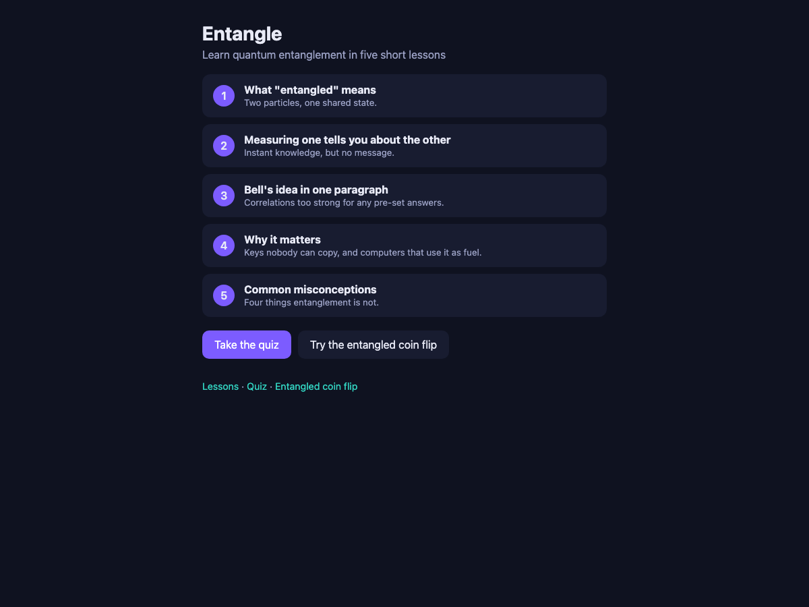
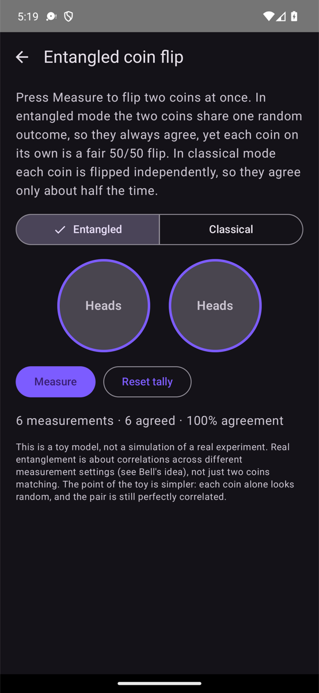
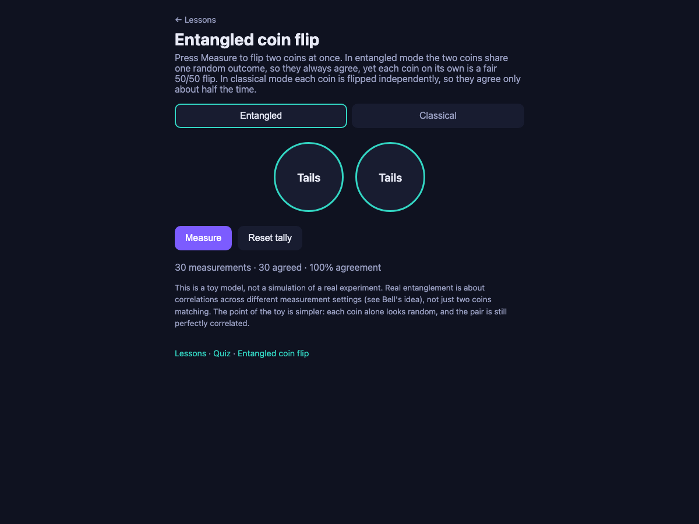

# Entangle - learn quantum entanglement

A deliberately small app, built three times: **iOS (SwiftUI)**, **Android (Jetpack Compose)**, and **web (Vite + TypeScript)**. All three render the same content contract, [`content/lessons.json`](content/lessons.json): five short lessons, a five-question quiz, and an "entangled coin flip" toy.

| Screen | What it does |
| --- | --- |
| Lessons | Five one-minute lessons: what "entangled" means, measuring one tells you about the other (but sends no message), Bell's idea, why it matters, common misconceptions. |
| Quiz | Five multiple-choice questions keyed to the lessons, with an explanation after each answer and a score at the end. |
| Entangled coin flip | Press **Measure**: in entangled mode the two coins always agree (one shared outcome); in classical mode they are independent. A running tally shows the agreement rate. The UI says plainly that it is a toy model. |

## Why this repo exists

This is the demo project for [Orcha](https://github.com/open-orcha/orcha), the open-source orchestrator that lets one human run a team of AI agents with real handoffs, reviews, and human verification. Three native apps that share one content file is the smallest project that shows Orcha's core story: **one task graph, three platform agents working in parallel, a reviewer in the chain, and a human who verifies from their phone.**

The demo runbook, with timed scenarios, narration lines, exact steps, and reset instructions, is in [`docs/DEMO_SCRIPT.md`](docs/DEMO_SCRIPT.md). Its six recording-ready stories cover adding a feature, fixing a bug through a review loop, running both mobile apps, exploring the code, and taking a GitHub issue through a checked PR. The demo cast is four agents: **Atlas** (orchestrator, owns `content/lessons.json`, reviews the platform PRs), **iOS Dev**, **Android Dev**, and **Web Dev**. Every scenario touches the Orcha web portal, the mobile app, and the CLI.

It is also a friendly first project for an agent: each app is a few files, has no backend, no auth, no analytics, and builds with one command. An agent can rebuild any of the three apps from scratch in 10-25 minutes.

## Run it

Everything builds from a fresh clone; there are no secrets or environment variables.

### Web

```sh
cd web && npm install && npm run dev
```

Opens on http://localhost:5173. `npm run build` type-checks and produces `web/dist/`; `npm test` runs the content-contract and coin-flip tests (Vitest).

### iOS

Requires Xcode 16+ and [XcodeGen](https://github.com/yonaskolb/XcodeGen) (`brew install xcodegen`).

```sh
cd ios && xcodegen generate && open Entangle.xcodeproj
```

Then press Run on an iPhone simulator. From the command line:

```sh
cd ios && xcodegen generate && xcodebuild -scheme Entangle -destination 'platform=iOS Simulator,name=iPhone 16' build
```

The `.xcodeproj` is generated from [`ios/project.yml`](ios/project.yml) and is not committed.

### Android

Requires a JDK 17+ and the Android SDK (Android Studio installs both). Point Gradle at the SDK once with `ANDROID_HOME` or `android/local.properties` (`sdk.dir=/path/to/sdk`).

```sh
cd android && ./gradlew assembleDebug
```

The debug APK lands in `android/app/build/outputs/apk/debug/`. Or open the `android/` folder in Android Studio and press Run. `./gradlew testDebugUnitTest` runs the coin-flip unit tests.

## Layout

```
content/lessons.json      the single content contract all three apps render
web/                      Vite + TypeScript, hash router, no framework
ios/                      SwiftUI; ios/project.yml -> Entangle.xcodeproj via XcodeGen
android/                  Kotlin + Jetpack Compose (Material 3), Gradle wrapper, minSdk 26
docs/DEMO_SCRIPT.md       the Orcha demo runbook
.github/workflows/ci.yml  builds web + Android on Ubuntu and iOS on a macOS runner
```

`content/lessons.json` is imported directly by the web app, bundled as a resource by `ios/project.yml`, and packaged as an Android asset from the same path by `android/app/build.gradle.kts`. Change the JSON once and all three apps pick it up on the next build.

## Screenshots

<!-- Web and Android captures are real. iOS remains a placeholder until Xcode's license is accepted on the recording Mac (docs/screenshots/README.md). -->

| iOS | Android | Web |
| --- | --- | --- |
| _iPhone simulator capture pending_ |  |  |
| _iPhone simulator capture pending_ |  |  |

## About the physics

The lessons are short but they are not hand-wavy: no faster-than-light signalling, Bell's inequality as a test of local pre-set answers, and the coin flip is labelled as the toy it is. If you spot an inaccuracy, open an issue or a PR against `content/lessons.json`.

## License

[MIT](LICENSE).
